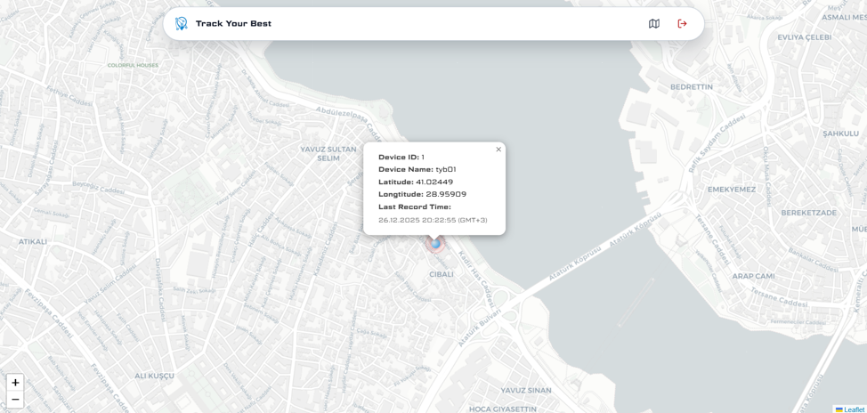

# Track Your Best 🚗📍

IoT & AI-Based Smart Mobility Platform for real-time vehicle tracking and movement analytics.

---

## 🎯 About

**Track Your Best (TYB)** is a graduation project that combines **IoT devices**, **PostGIS spatial databases**, and **AI-powered analytics** to provide intelligent vehicle tracking and route optimization.

### Problem
Most mobility data goes unrecorded. Existing systems focus only on vehicles, not individuals, and lack AI-driven insights for efficient routing and accessibility.

### Solution
Real-time GPS tracking via ESP32 IoT devices with cellular connectivity, secure cloud infrastructure, AI-powered movement insights, and an intuitive web interface.

---

## 🛠️ Tech Stack

- **IoT Hardware:** ESP32 + SIM808/A7670 GPS/GPRS modules
- **Backend:** .NET 8 Web API (ASP.NET Core)
- **Database:** PostgreSQL 15 + PostGIS 3.4 (spatial data)
- **Communication:** MQTT Protocol with TLS encryption
- **Deployment:** Docker + Docker Compose
- **Frontend:** React + Leaflet.js (real-time map visualization)

---

## ✨ Features

- 📍 **Real-time GPS tracking** via IoT devices
- 🗺️ **Interactive map** with live device locations
- 📊 **Movement analytics** (speed, stops, direction)
- 🚦 **Geofencing** with entry/exit alerts
- 🤖 **AI-powered insights** (ETA prediction, route optimization)
- 📈 **Driver behavior analysis** with performance scoring
- 🔒 **Secure data transmission** (MQTT over TLS)

---

## 👥 Team

**Graduation Project Team:**
- [Barış Can Aslan](https://github.com/bariscanaslan)
- [Yiğit Avar](https://github.com/yigitavar)
- [Toprak Kamburoğlu](https://github.com/ToprakKamburoglu)

**Project Advisor:** Dr. İlktan Ar

---

## 🌐 Demo

Visit [trackyourbest.net](https://trackyourbest.net/) to request a live demo.

**Group repository:** [github.com/bariscanaslan/track-your-best](https://github.com/bariscanaslan/track-your-best)

---

## 📝 License

This project is part of a graduation thesis. Contact the team for usage inquiries.

---

## 🙏 Acknowledgments

- **Dronos Team** for technical guidance
- **Asst. Prof. İlktan Ar** for project supervision
